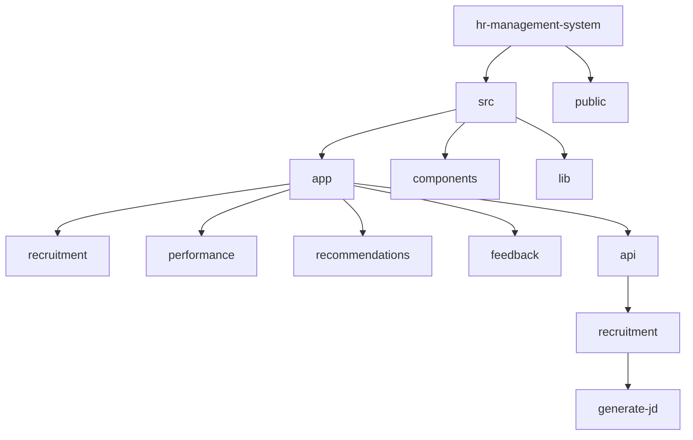
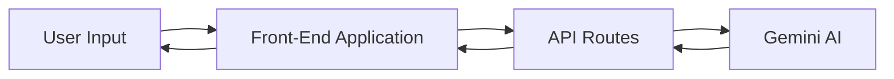
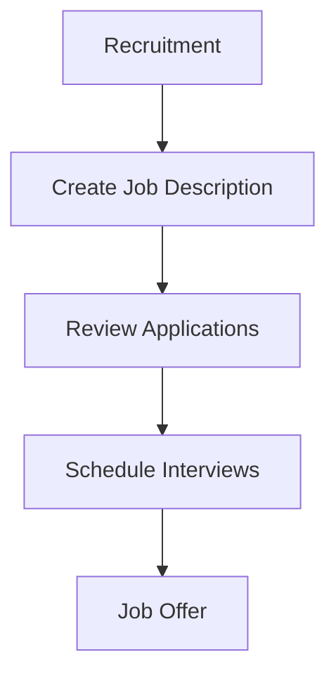
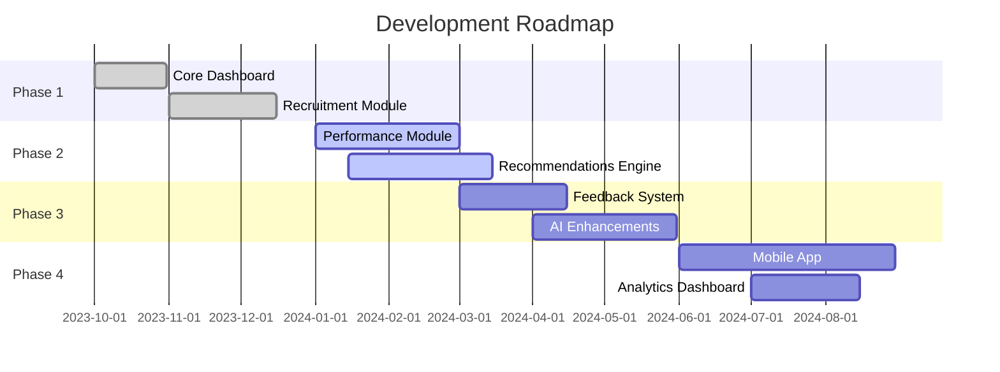

# Recruitment-AI: HR Management System 🚀


## 📋 Table of Contents
- [Overview](#-overview)
- [Features](#-features)
- [Project Structure](#-project-structure)
- [Getting Started](#-getting-started)
- [Technology Stack](#-technology-stack)
- [AI Integration](#-ai-integration)
- [Modules](#-modules)
- [API Routes](#-api-routes)
- [Screenshots](#-screenshots)
- [Development Roadmap](#-development-roadmap)
- [Contributing](#-contributing)
- [License](#-license)

## 🌟 Overview

Recruitment-AI is a comprehensive, AI-powered HR Management System designed to streamline recruitment processes, performance tracking, career recommendations, and employee feedback. The platform leverages modern technologies like Next.js 15, React 19, and Google's Gemini AI to create an intuitive and efficient human resources management experience.

## ✨ Features

| Module | Features | Status |
|--------|----------|--------|
| **Recruitment** | AI-powered JD creation, candidate matching, interview scheduling | ✅ |
| **Performance** | Employee tracking, analytics, reviews, timesheets | ✅ |
| **Recommendations** | Career paths, skills analysis, contract conversions | ✅ |
| **Feedback** | Virtual assistant, HR desk, surveys, analytics | ✅ |

## 🗂️ Project Structure



## 🚀 Getting Started

### Prerequisites
- Node.js 18.x or later
- npm or yarn or pnpm or bun

### Installation

```bash
# Clone the repository
git clone https://github.com/yourusername/recruitment-ai.git
cd recruitment-ai/hr-management-system

# Install dependencies
npm install
# or
yarn install
# or
pnpm install
# or
bun install

# Set up environment variables
# Create .env.local file with:
GEMINI_API_KEY=your_gemini_api_key

# Run the development server
npm run dev
# or
yarn dev
# or
pnpm dev
# or
bun dev
```

Open [http://localhost:3000](http://localhost:3000) with your browser to see the application.

## 💻 Technology Stack

| Technology | Version | Purpose |
|------------|---------|---------|
| Next.js | 15.1.6 | React framework |
| React | 19.0.0 | UI library |
| TypeScript | 5.x | Type safety |
| TailwindCSS | 3.4.1 | Styling |
| Google Generative AI | 0.21.0 | AI capabilities |
| Lucide React | 0.474.0 | Icons |
| Radix UI | 1.1.2 | UI components |

## 🤖 AI Integration

Recruitment-AI integrates Google's Generative AI (Gemini) for various AI-powered features:



- **Job Description Generation**: Automatic creation of professional job descriptions based on input criteria
- **Interview Questions**: AI-generated technical and behavioral questions tailored to job positions
- **Feedback Analysis**: Sentiment analysis and insights from employee feedback
- **Performance Insights**: AI-powered recommendations for employee development

## 📊 Modules

### 1. Recruitment Module

- **Create Job**: AI-powered job description creation
- **Applications**: Track and review candidates
- **Interview Scheduling**: Manage interview process



### 2. Performance Module

Comprehensive performance tracking and analytics for employees.

- **Team Performance**: Track team metrics
- **Reviews**: Manage performance reviews
- **Timesheets**: Track time allocation
- **Reports**: Generate detailed performance reports

### 3. Recommendations Module

AI-powered career progression and development insights.

- **Career Paths**: Suggested role progressions
- **Skill Analysis**: Identify skill gaps
- **Conversions**: Contract to permanent conversion recommendations

### 4. Feedback Module

Employee feedback collection and analysis system.

- **Virtual Assistant**: AI-powered conversational interface
- **HR Employee Desk**: Manage employee requests efficiently
- **Survey & Feedback**: Create and analyze employee surveys
- **Analytics & Insights**: Real-time feedback analysis

## 📡 API Routes

| Endpoint | Method | Description |
|----------|--------|-------------|
| `/api/recruitment/generate-jd` | POST | Generates job descriptions and interview questions |

## 📸 Screenshots

The application provides a comprehensive UI with dashboard, recruitment, performance management, career recommendations, and feedback systems.

## 🗓️ Development Roadmap



## 🤝 Contributing

Contributions are welcome! Please feel free to submit a Pull Request.

1. Fork the repository
2. Create your feature branch (`git checkout -b feature/amazing-feature`)
3. Commit your changes (`git commit -m 'Add some amazing feature'`)
4. Push to the branch (`git push origin feature/amazing-feature`)
5. Open a Pull Request

## 📄 License

This project is licensed under the MIT License - see the LICENSE file for details.

---

© 2024 Recruitment-AI Team. All rights reserved.
